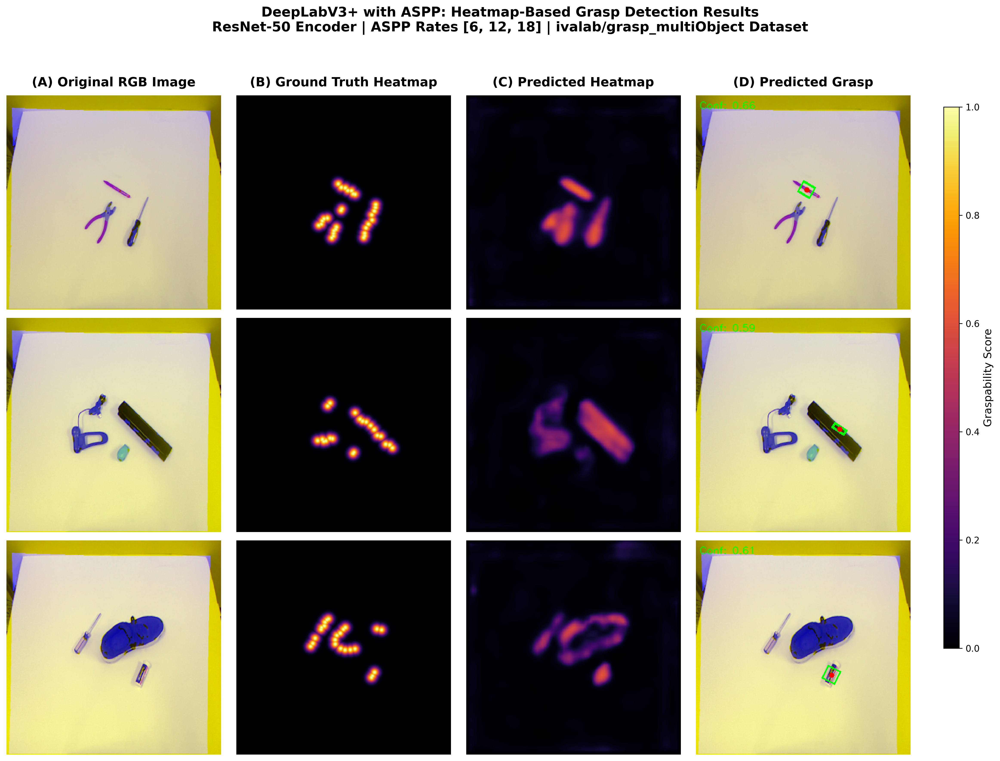
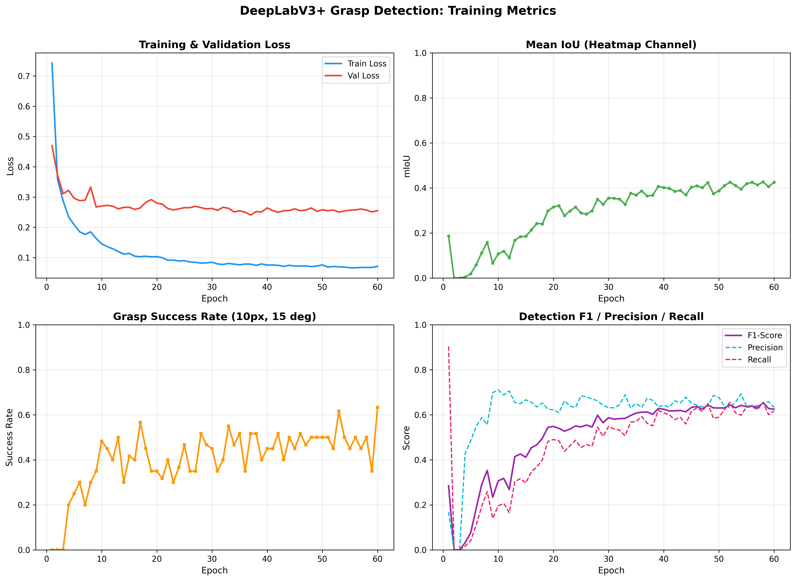
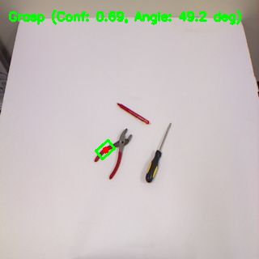
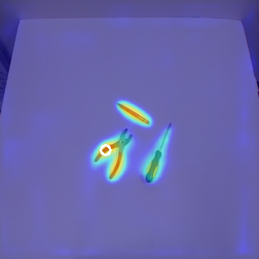

<div align="center">

# 🤖 Deep Multi-Scale Heatmap Prediction for Robotic Grasping

### *A Dense Prediction Approach for Cluttered Multi-Object Environments*

[](https://python.org)
[](https://pytorch.org)
[](https://nvidia.com)

<br>

</div>

## Overview

Robotic grasp detection in cluttered scenes is challenging — objects vary in size, overlap, and require precise angle estimation. Traditional **coordinate regression** models (backbone → FC → single grasp vector) discard all spatial information at the global pooling layer, causing predictions to collapse to degenerate locations regardless of where objects actually are.

This project solves that problem by reformulating grasp detection as **dense, pixel-wise prediction**. A DeepLabV3+ encoder-decoder with **Atrous Spatial Pyramid Pooling (ASPP)** produces a 4-channel heatmap at every pixel, preserving full spatial correspondence between input and output.

<div align="center">

<p><em>Three sample scenes showing: Original RGB → Ground Truth Heatmap → Predicted Heatmap → Predicted Grasp Box</em></p>
</div>

---

## Results

Evaluated on the [ivalab/grasp_multiObject](https://github.com/ivalab/grasp_multiObject) dataset (96 RGB-D images, multi-object cluttered scenes):

<div align="center">

| Metric | Score |
|:------:|:-----:|
| **Mean IoU** | `0.426` |
| **Success Rate** (10px, 15°) | `63.3%` |
| **F1-Score** | `0.625` |
| **Precision** | `0.633` |
| **Recall** | `0.617` |

</div>

<div align="center">

<p><em>Training dynamics: loss convergence, mIoU improvement, success rate, and F1/precision/recall over 60 epochs.</em></p>
</div>

---

## Method

### RG-D Input Encoding

The Blue channel is replaced with the aligned Depth map, creating a 3-channel **RG-D** input. This provides geometric surface information while remaining compatible with ImageNet-pretrained backbones (no architecture changes needed for the encoder).

### Architecture: DeepLabV3+ with ASPP

```
RG-D Input (320×320)
       │
  ResNet-50 Encoder (pretrained, partially frozen)
       │
       ├── Layer 1 (80×80 × 256) ─── Low-level features ──────┐
       │                                                        │
       └── Layer 4 (10×10 × 2048)                              │
                │                                               │
         ┌──── ASPP ────┐                                       │
         │  rate = 1    │                                       │
         │  rate = 6    │  ← multi-scale context                │
         │  rate = 12   │                                       │
         │  rate = 18   │                                       │
         │  global pool │                                       │
         └──────┬───────┘                                       │
                │                                               │
         Upsample 8× ──────────── Concat ◄─────────────────────┘
                                    │
                              Refine (3×3 convs)
                                    │
                              Upsample 4×
                                    │
                    ┌───────────────┼───────────────┐
                 Heatmap      Angle (sin/cos)     Width
                 Sigmoid         Tanh            Sigmoid
                    │               │               │
                    └───── Output (4 × 320 × 320) ──┘
```

**Why ASPP?** Objects in the same scene span wildly different scales — a pen is ~20px wide, pliers are ~100px. The parallel dilated convolutions at rates [6, 12, 18] give the model multiple receptive fields simultaneously, capturing context from fine-grained to scene-level.

### 4-Channel Output

| Channel | Meaning | Activation |
|:-------:|:--------|:----------:|
| 0 | Graspability heatmap | Sigmoid → [0, 1] |
| 1 | sin(2θ) | Tanh → [-1, 1] |
| 2 | cos(2θ) | Tanh → [-1, 1] |
| 3 | Normalized gripper width | Sigmoid → [0, 1] |

The angle is encoded trigonometrically as **(sin 2θ, cos 2θ)** to eliminate discontinuities and handle the 180° grasp symmetry. At inference, the grasp is recovered by finding the heatmap peak and reading angle/width at that pixel.

### Inference

<div align="center">
&nbsp;&nbsp;&nbsp;&nbsp;

<p><em>Left: Predicted grasp rectangle on the pliers handle. Right: Heatmap overlay showing per-object graspability activation.</em></p>
</div>

---

## Getting Started

### Requirements

```bash
pip install torch torchvision numpy opencv-python matplotlib
```

### Dataset

Download and extract the [ivalab/grasp_multiObject](https://github.com/ivalab/grasp_multiObject) dataset, then run preprocessing:

```bash
python process_grasps.py
```

### Train

```bash
python train.py
```

Logs mIoU, Success Rate, and F1-Score every epoch. Best model saved to `best_grasp_heatmap.pth`.

### Inference

```bash
python inference.py
```

### Training Configuration

| Parameter | Value |
|:----------|:------|
| GPU | NVIDIA RTX 4060 (8 GB) |
| Batch Size | 4 |
| Epochs | 60 |
| Encoder LR | 1 × 10⁻⁵ (fine-tune) |
| Decoder LR | 1 × 10⁻³ (train from scratch) |
| Mixed Precision | FP16 via GradScaler |
| Frozen Layers | Stem + Layer1 + Layer2 |
| Parameters | 40.3M total (38.9M trainable) |

---

## References

- Chen et al., *"Encoder-Decoder with Atrous Separable Convolution for Semantic Image Segmentation"*, ECCV 2018
- He et al., *"Deep Residual Learning for Image Recognition"*, CVPR 2016
- Morrison et al., *"Closing the Loop for Robotic Grasping"*, RSS 2018
- Kumra & Kanan, *"Robotic Grasp Detection Using Deep CNNs"*, IROS 2017
